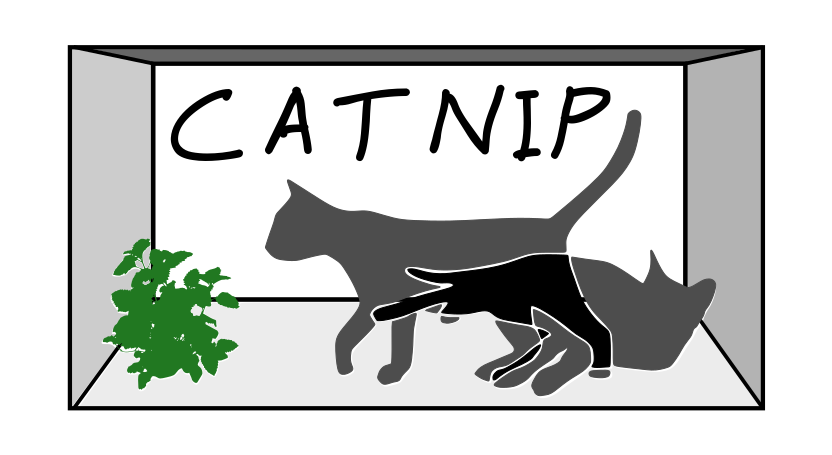

# QC_Tools or CATNIP - ChArge TraNsfer Integral Package

## Badges

[](https://app.codacy.com/app/JoshuaSBrown/QC_Tools?utm_source=github.com&utm_medium=referral&utm_content=JoshuaSBrown/QC_Tools&utm_campaign=Badge_Grade_Dashboard)
[](https://gitter.im/QC_Tools/Lobby?utm_source=badge&utm_medium=badge&utm_campaign=pr-badge&utm_content=badge)
[]()
[](https://travis-ci.org/JoshuaSBrown/QC_Tools)
[](https://codecov.io/gh/JoshuaSBrown/QC_Tools)
[](https://www.deepcode.ai/app/gh/JoshuaSBrown/QC_Tools/_/dashboard?utm_content=gh%2FJoshuaSBrown%2FQC_Tools)

# Updates

Message to users:

1. The wiki has been ported to github pages, I have left the documentation in the wiki but it will become deprecated in the future.
2. Version 2.0 is in the works, will provide additional functionality.

## Documentation

* [CATNIP Home](https://joshuasbrown.github.io/docs/CATNIP/catnip_home.html)
* [Downloading & Building](https://joshuasbrown.github.io/docs/CATNIP/catnip_downloads.html)
* [Theory](https://joshuasbrown.github.io/docs/CATNIP/catnip_theory.html)
* [Gaussian Files](https://joshuasbrown.github.io/docs/CATNIP/catnip_gaussian_files.html)
* [Tutorial 1](https://joshuasbrown.github.io/docs/CATNIP/catnip_tutorial1.html)
* [Tutorial 2](https://joshuasbrown.github.io/docs/CATNIP/catnip_tutorial2.html)
* [Tutorial 3](https://joshuasbrown.github.io/docs/CATNIP/catnip_tutorial3.html)
* [Common Problems](https://joshuasbrown.github.io/docs/CATNIP/catnip_common_problems.html)
* [Versions](https://joshuasbrown.github.io/docs/CATNIP/catnip_versions.html)
* [Resources](https://joshuasbrown.github.io/docs/CATNIP/catnip_resources.html)
* [Papers](https://joshuasbrown.github.io/docs/CATNIP/catnip_papers.html)

## Objective

CATNIP is meant to make difficult calculations accessible to the masses. The focus is to accelerate science and industry by:
 * using an accessible license
 * providing good documentation
 * easy installation
 * sharing ownership and encouraging collaboration
 
I welcome feedback and contributors. If you have suggestions for integrating CATNIP with other programs please do not hesitate to create an issue or contact me on gitter. You can do this by clicking on the gitter badge.

If you run into a problem feel free to create an issue on [github](https://github.com/JoshuaSBrown/QC_Tools/issues), just be sure to give me enough information to reproduce the error, otherwise I won't be able to fix it. If I do not respond promptly feel free to reach out again. Often responses get filtered to my spam folder or I simply do not see them.

## Citing

If you use CATNIP to get values for a paper it would be nice if you cited it. To know how to cite it you can simply pass the folloing -cite flag to `calc_J` as:

```calc_J -cite```

It would also be nice if you starred the repo... if you find it useful.

## Acknowledgements and Relevant Papers

[1]	B. Baumeier, J. Kirkpatrick, and D. Andrienko, “Density-functional based determination of intermolecular charge transfer properties for large-scale morphologies,” Phys. Chem. Chem. Phys., vol. 12, no. 36, p. 11103, 2010.  
[2]	E. F. Valeev, V. Coropceanu, D. a da Silva Filho, S. Salman, and J.-L. Brédas, “Effect of electronic polarization on charge-transport parameters in molecular organic semiconductors.,” J. Am. Chem. Soc., vol. 128, no. 30, pp. 9882–6, Aug. 2006.  

The author would like to acknowledge insightful correspondence with E. F. Valeev and B. Baumeier. 

### Thanks to the following for helping to make CATNIP better

* NKUCodingCat 
* dwaipayanroni
* rdft4e
* ivorever
* Caleb Wehrmann
